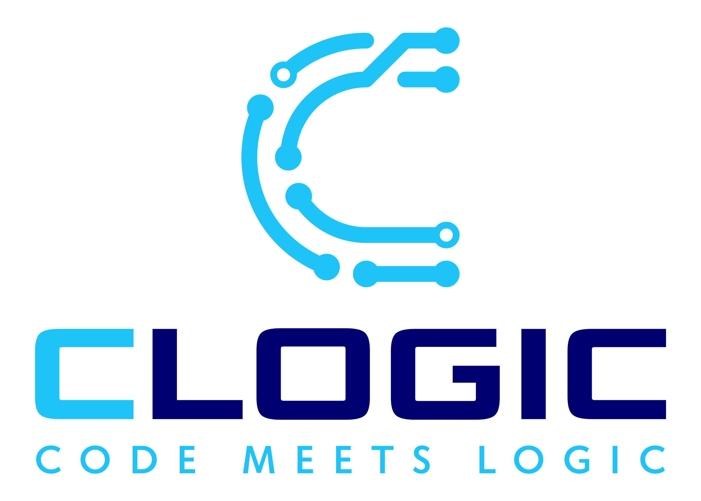

# Good Code Solves Problems. Great Systems Prevent Them

CLogic is a systems-driven Unity development agency.  
We build modular systems and scalable tools for studios that care about long-term reliability.
### You build the world — we'll make sure it runs

## Interested In Working With Us?

For project inquiries or collaboration opportunities, visit [**clogic.dev**](https://clogic.dev)  
or reach us at [**contact@clogic.dev**](mailto:contact@clogic.dev).

## Are you a client?

Check your project's progress below.
*(Access is limited to respective clients)*
<!--

**Here are some ideas to get you started:**

🙋‍♀️ A short introduction - what is your organization all about?
🌈 Contribution guidelines - how can the community get involved?
👩‍💻 Useful resources - where can the community find your docs? Is there anything else the community should know?
🍿 Fun facts - what does your team eat for breakfast?
🧙 Remember, you can do mighty things with the power of [Markdown](https://docs.github.com/github/writing-on-github/getting-started-with-writing-and-formatting-on-github/basic-writing-and-formatting-syntax)
-->

